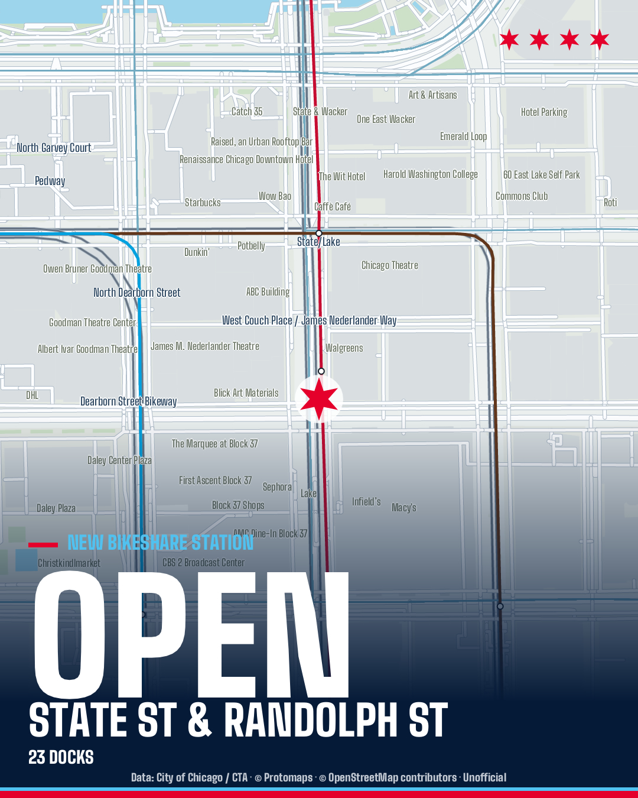
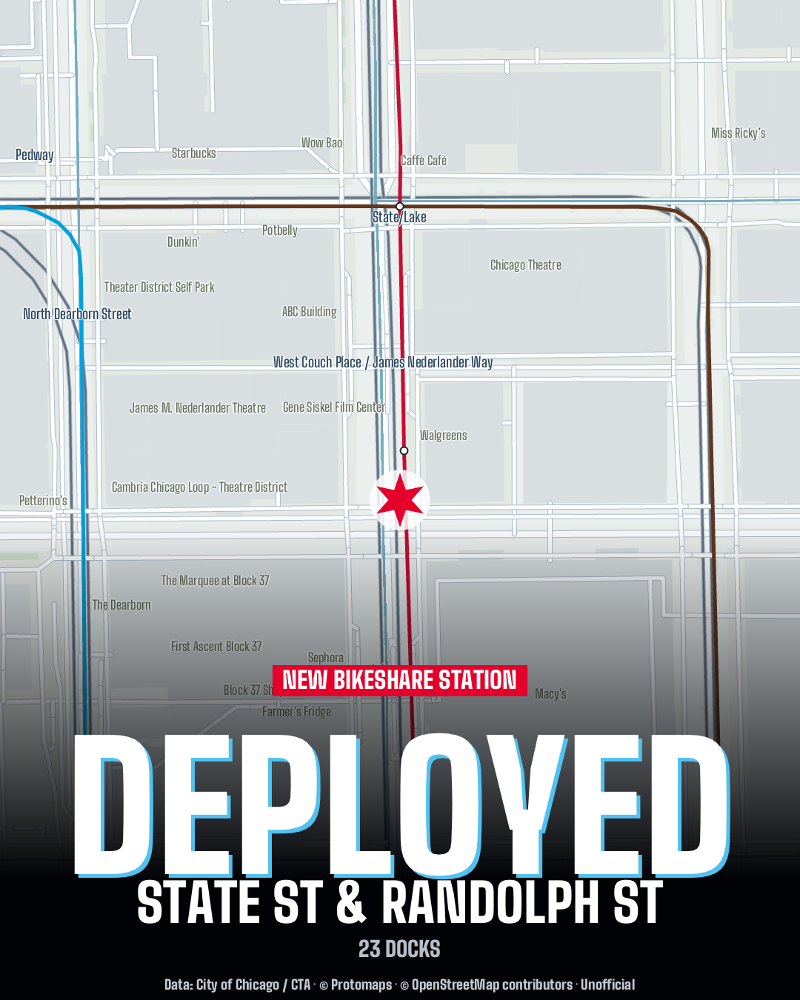

# Chicago Bikeshare Bot

A one-shot Rust worker that watches Chicago's Divvy inventory and announces new
or newly electrified stations on
[@chi-bike-stations.bsky.social](https://bsky.app/profile/chi-bike-stations.bsky.social).
It draws civic/nightline map cards directly on the CPU and optionally publishes
Google Street View as the first reply. The worker needs no browser, Node, Python or GPU. Production uses the Rust
Petit scheduler; host deployment/health utilities use Ubuntu’s Python standard library.

This is an **independent, unofficial project**, not affiliated with or endorsed
by the City of Chicago, Divvy, Lyft, or CTA. Alerts describe changes observed in
a daily inventory, including inactive stations; they do not confirm opening
dates, live availability, or working charging equipment. Electrification is
inferred from station names. Check the official service before riding.
See [data sources and notices](NOTICE.md) and the
[terms review and unresolved permissions](docs/data-terms-review.md).

The City of Chicago's [Data Terms of Use](https://www.chicago.gov/city/en/narr/foia/data_disclaimer.html)
require this notice:

> This site provides applications using data that has been modified for use from its original source, www.cityofchicago.org, the official website of the City of Chicago. The City of Chicago makes no claims as to the content, accuracy, timeliness, or completeness of any of the data provided at this site. The data provided at this site is subject to change at any time. It is understood that the data provided at this site is being used at one’s own risk.

## Run locally

Install the toolchain in `rust-toolchain.toml`, then:

```sh
cp .env.example .env
cargo build --release --locked
cargo run --release -- run
cargo run --release -- status
```

Publishing defaults to **off**. The first valid snapshot creates a silent
baseline. Later snapshots queue new/electrified events even while publishing is
disabled. Use a disposable database for testing; do not point a shadow run at
your live state. To publish, configure the existing Bluesky app password and
Protomaps key, review pending deliveries, then set `PUBLISH_ENABLED=true`.

```sh
cargo run --release -- check
cargo run --release -- render STATION_ID output/civic.jpg civic
cargo run --release -- render STATION_ID output/nightline.jpg nightline
```

`status`, `check`, and `render` require an existing database and open it read-only.
`check` verifies integrity, foreign keys, persisted payloads, styles and record
keys. `init` explicitly creates an empty v2 database without fetching anything.
`import-legacy PATH` explicitly imports a Python-era baseline into an empty
target; **do not use this command for the production Rust cutover**.

## State and delivery guarantees

The Rust worker uses the **existing v2 SQLite database in place**. It does not
migrate, replace, truncate, or rebaseline an existing database. Unknown schema
versions fail closed. Opening an existing DB for a run does not change its
journal mode or migration records. Ordinary runs continue updating observed
station state, creating new events, and recording delivery/run results.

Historical stations absent from the current feed are retained. Asterisk-suffixed
names and short names containing `charging` identify electrification. Event
uniqueness remains `(event type, station ID)`. First-seen timestamps, completed
deliveries, persisted civic/nightline choices, existing root keys, reply-key
calculation, and camelCase event JSON remain compatible with the TypeScript
worker, so reverting to the previous image does not require a DB rollback.

Reconciliation is transactional. Invalid, empty, too-small, duplicate-ID or
potentially truncated feeds are rejected before station updates. Retries use
exponential backoff capped at 12 hours. Processing claims older than 30 minutes
are recovered. An OS lock alongside the DB prevents overlapping Rust runs;
the deployment wrapper also serializes worker runs against release switches.

Each retry checks Bluesky for the persisted record key before doing expensive
rendering/uploading. An uncertain create response is reconciled by that same
key. Existing roots and replies are reused. Unavailable Street View remains
nonfatal; a failure creating a reply requeues delivery. No automated test
publishes to the live account.

## Memory and rendering

Work is sequential: one HTTP response, one tile and one delivery at a time.
The station snapshot is dropped before image generation. SQLite's page cache
is capped at 2 MiB; network bodies, map dimensions and geometry sizes are
bounded. Fonts are embedded in the executable and only
rasterized when needed. JPEG output stays under Bluesky's 2,000,000-byte limit.

The native renderer reads real Protomaps vector tiles, labels nearby streets
and POIs, and fetches geographically filtered CTA routes/stations. It preserves
the card colors, station marker and alternating styles, with Bikeshare Station
headings and a single line of source credits. Cartographic
styling and label placement differ from MapLibre; it is not a general MapLibre
style interpreter. `PROTOMAPS_STYLE_URL` can supply a compatible vector source
or TileJSON, but its paint/layout expressions are not applied.

See [migration plan and audit](docs/rust-migration.md) and
[verification results](docs/verification.md) for measured memory and limits.

| Native civic | Native nightline |
| --- | --- |
|  |  |

## Configuration

Environment variables override the local `.env`. Production's existing
`/etc/divvy-bot.env` remains in place; only `BLUESKY_IDENTIFIER` changes to the
renamed `chi-bike-stations.bsky.social` handle. The template is [`.env.example`](.env.example).

| Variable | Default | Purpose |
| --- | --- | --- |
| `PUBLISH_ENABLED` | `false` | Deliver queued events to Bluesky. |
| `POST_LIMIT` | `10` | Maximum delivery attempts per run, 1–100. |
| `DB_PATH` | `data/chicago-bikeshare-bot.sqlite3` | Existing SQLite state or a new local DB. |
| `BLUESKY_SERVICE_URL` | `https://bsky.social` | Session service; authenticated writes use the returned PDS. |
| `BLUESKY_IDENTIFIER`, `BLUESKY_APP_PASSWORD` | unset | Required when publishing. |
| `SODA_URL` | Chicago `bbyy-e7gq.json` | Station source endpoint. |
| `SODA_TIMEOUT_MS` | `30000` | Source request deadline. |
| `SODA_MAX_RETRIES` | `3` | Additional source attempts, 0–10. |
| `SODA_MIN_STATIONS` | `500` | Minimum accepted complete snapshot; at least 1. |
| `PROTOMAPS_KEY` | unset | Existing hosted vector tile API key. |
| `PROTOMAPS_STYLE_URL` | unset | Optional compatible vector-source override. |
| `MAP_WIDTH`, `MAP_HEIGHT` | `1080`, `1350` | Logical image dimensions, each 600–2400. |
| `MAP_PIXEL_RATIO` | `1` | Scale, 1–3; final image limited to 6 megapixels. |
| `MAP_ZOOM`, `MAP_NIGHTLINE_ZOOM` | `17`, `17.5` | Civic/nightline zoom, 12–19. |
| `MAP_RENDER_TIMEOUT_MS` | `75000` | Deadline per map attempt. |
| `MAP_RENDER_MAX_ATTEMPTS` | `2` | Render attempts, 1–5. |
| `MAP_RENDER_RETRY_DELAY_MS` | `2000` | Delay between attempts. |
| `STREETVIEW_ENABLED` | `false` | Optional image reply. |
| `GOOGLE_MAPS_API_KEY` | unset | Required with Street View enabled. |
| `STREETVIEW_TIMEOUT_MS` | `10000` | Street View request deadline. |
| `OUTPUT_DIR` | `output` | Default manual-render directory. |

Boolean values accept `true`, `false`, `1`, `0`. Obsolete `NODE_ENV` and
`AGENT_BROWSER_EXECUTABLE_PATH` values may remain in production; Rust ignores
them. Credentials, API keys, and configured style URLs are redacted from errors.

## Production deployment

GitHub CI builds the native `chicago-bikeshare-bot` and a pinned Petit `pt`.
After main passes CI and the production environment approval, a release channel
points to the tested, checksummed bundle. The host polls every five minutes,
validates a disposable copy of production state, switches the executable
symlink, and runs a verified cycle. No Docker or on-host compilation is needed.

Petit schedules runs at **00:00, 06:00, 12:00 and 18:00 UTC**. Systemd keeps Petit
running, catches up a missed schedule on restart, and limits the scheduler plus
worker to 96 MiB. The worker exits between runs. SQLite, credentials, worker
logs and Petit’s separate history live outside versioned release directories.

See [deployment and CLI operations](deploy/README.md) for updates, rollback,
manual runs and the deliberately preserved legacy database/credential paths.
The optional Dockerfile remains available for isolated local testing.

## Development checks

```sh
cargo fmt --check
cargo clippy --all-targets --all-features --locked -- -D warnings
cargo test --locked
python3 -m unittest discover -s tests -p 'test_*.py' -v
scripts/build-release
python3 tests/petit_smoke.py dist/bundle/pt
```
